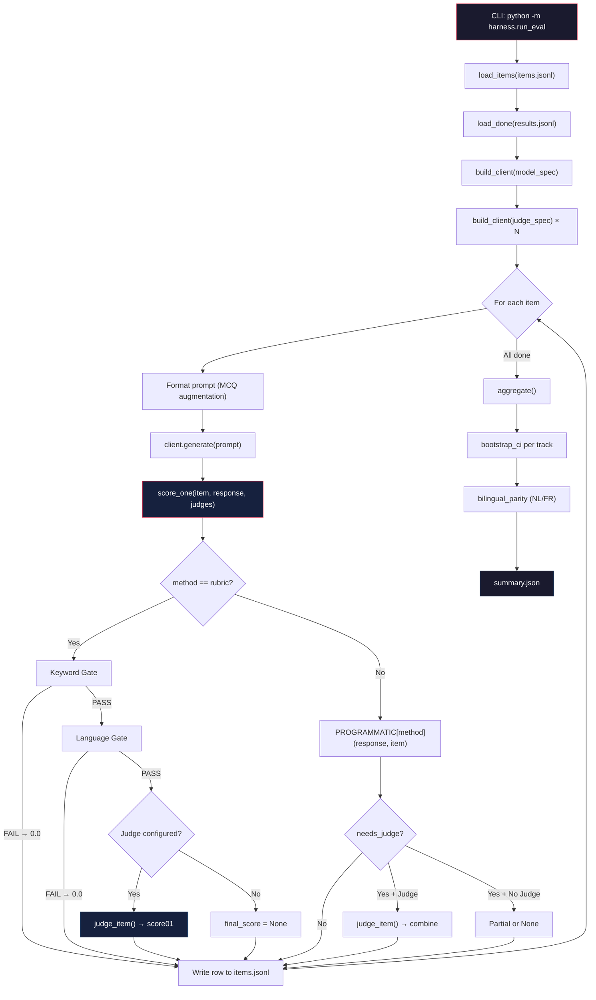
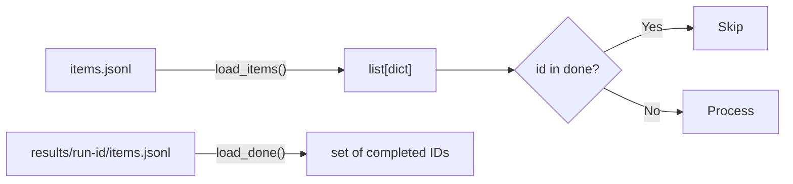
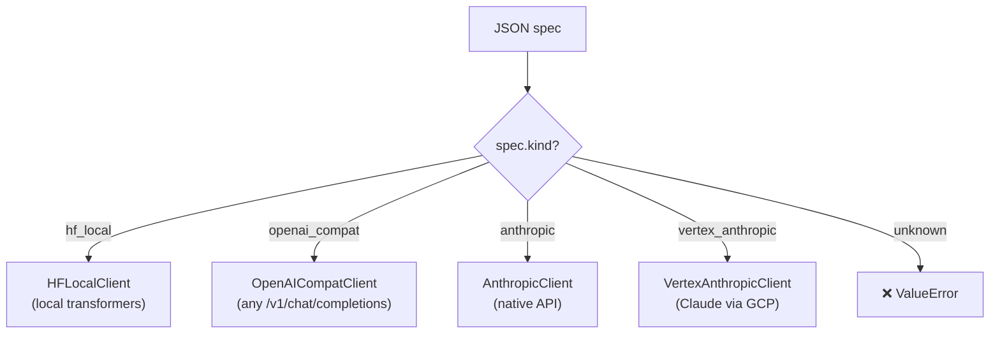
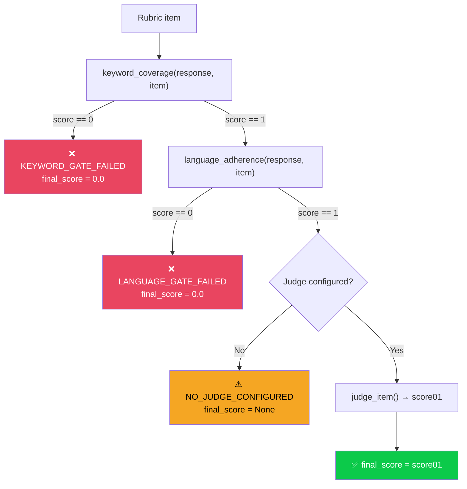
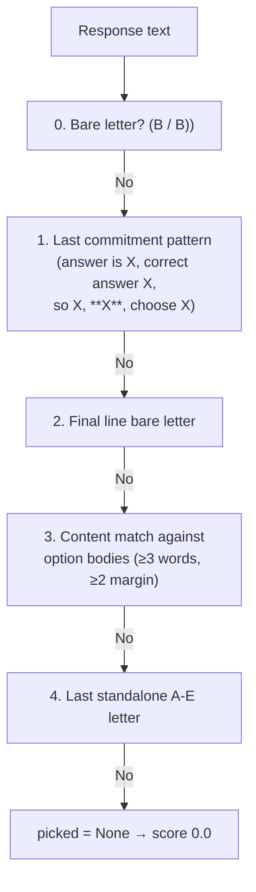
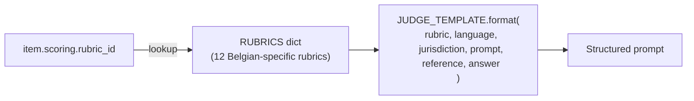
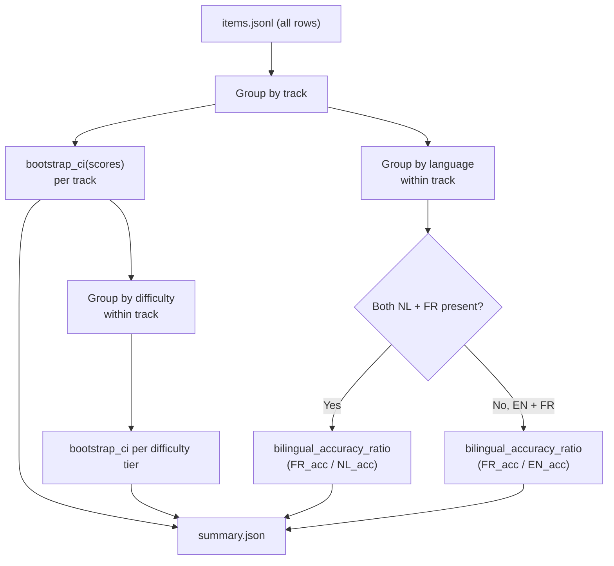

# BE-LexBench — End-to-End Pipeline Walkthrough

## Pipeline Overview



---

## Step 1 — CLI Entry Point & Configuration

> **File**: [run_eval.py → main()](file:///c:/Users/hayta_o4yzgf5/Downloads/cblre-main/cblre-main/harness/run_eval.py#L188-L248)

```bash
python -m harness.run_eval \
  --items data/items.jsonl \
  --model '{"kind":"openai_compat","model_name":"your-model","base_url":"http://localhost:8000/v1"}' \
  --run-id your-model-v1 \
  --judge '{"kind":"anthropic","model_name":"claude-sonnet-4-6","api_key_env":"ANTHROPIC_API_KEY"}' \
  --out-dir ./results
```

| Argument | Purpose | Default |
|---|---|---|
| `--items` | Path to JSONL eval items | *required* |
| `--model` | JSON client spec for the model being evaluated | *required* |
| `--run-id` | Unique identifier for this run | *required* |
| `--judge` | JSON client spec for the LLM judge (repeat for ensemble) | *none — rubric items unscored* |
| `--out-dir` | Output directory | `./results` |
| `--max-tokens` | Max generation tokens | `512` |
| `--temperature` | Sampling temperature | `0.0` (greedy) |

---

## Step 2 — Load Items & Resume

> **Files**: [load_items()](file:///c:/Users/hayta_o4yzgf5/Downloads/cblre-main/cblre-main/harness/run_eval.py#L55-L68), [load_done()](file:///c:/Users/hayta_o4yzgf5/Downloads/cblre-main/cblre-main/harness/run_eval.py#L71-L80)



Each item is validated against the [eval_item.schema.json](file:///c:/Users/hayta_o4yzgf5/Downloads/cblre-main/cblre-main/schema/eval_item.schema.json):

| Field | Type | Purpose |
|---|---|---|
| `id` | string | Unique item ID (pattern: `^[a-z0-9-]+$`) |
| `track` | enum | One of 14 Belgian legal tracks |
| `language` | enum | `nl`, `fr`, or `en` |
| `difficulty` | enum | `core`, `applied`, `expert` |
| `format` | enum | `mcq`, `open`, `tool_call`, `rag` |
| `prompt` | string | The question to send to the model |
| `scoring.method` | enum | Which scorer handles this item |
| `provenance.canary` | string | Contamination-detection canary |

> [!NOTE]
> **Resumability**: `load_done()` reads already-completed IDs from the results file. On re-run, completed items are skipped. Results are flushed line-by-line.

### Test Coverage — Step 2

| Test | What it pins |
|---|---|
| [TestLoadItems.test_reads_all_items](file:///c:/Users/hayta_o4yzgf5/Downloads/cblre-main/cblre-main/tests/test_run_eval.py#L52-L57) | JSONL parsing, UTF-8 |
| [TestLoadDone.test_missing_file_returns_empty_set](file:///c:/Users/hayta_o4yzgf5/Downloads/cblre-main/cblre-main/tests/test_run_eval.py#L63-L64) | First-run (no prior results) |
| [TestLoadDone.test_reads_ids](file:///c:/Users/hayta_o4yzgf5/Downloads/cblre-main/cblre-main/tests/test_run_eval.py#L66-L70) | Resume from partial run |

---

## Step 3 — Build Model Clients

> **File**: [build_client()](file:///c:/Users/hayta_o4yzgf5/Downloads/cblre-main/cblre-main/harness/models.py#L363-L418)



All clients implement `generate(prompt, system, context, tools, max_tokens, temperature) → GenResult`:

```python
@dataclass
class GenResult:
    text: str           # The model's response text
    raw: dict           # Full API response for debugging
    model_id: str       # Exact model identifier
    latency_s: float    # Wall-clock generation time
```

### Special Handling

| Model Family | Handling |
|---|---|
| **Qwen3 (thinking mode)** | `chat_template_kwargs: {"enable_thinking": false}` suppresses CoT |
| **DeepSeek-R1 / QwQ** | Always-on reasoning; `mcq_exact` uses last-committed-answer strategy |
| **Tool calls via vLLM** | Auto-retry: if tools param rejected (400), folds schema into prompt |
| **Anthropic tool use** | Tool blocks serialized to `<tool_call>{json}</tool_call>` format |

### Test Coverage — Step 3

| Test | What it pins |
|---|---|
| [TestBuildMessages.*](file:///c:/Users/hayta_o4yzgf5/Downloads/cblre-main/cblre-main/tests/test_models.py#L19-L50) | Message construction (system, context, user ordering) |
| [TestBuildSystemAndUser.*](file:///c:/Users/hayta_o4yzgf5/Downloads/cblre-main/cblre-main/tests/test_models.py#L53-L78) | Anthropic-style system/user split |
| [TestOpenAIToolsToAnthropic.*](file:///c:/Users/hayta_o4yzgf5/Downloads/cblre-main/cblre-main/tests/test_models.py#L81-L132) | Tool format conversion (OpenAI → Anthropic) |
| [TestBuildClient.*](file:///c:/Users/hayta_o4yzgf5/Downloads/cblre-main/cblre-main/tests/test_models.py#L176-L257) | Factory routing for all 4 kinds + errors |
| [TestGenResult.*](file:///c:/Users/hayta_o4yzgf5/Downloads/cblre-main/cblre-main/tests/test_models.py#L262-L275) | Dataclass defaults and explicit fields |

---

## Step 4 — Prompt Formatting & Generation

> **File**: [run_eval.py → main() loop](file:///c:/Users/hayta_o4yzgf5/Downloads/cblre-main/cblre-main/harness/run_eval.py#L214-L230)

```python
# MCQ items get choices appended + letter constraint
if item.get("format") == "mcq" and item.get("choices"):
    prompt = (prompt.rstrip() + "\n" + "\n".join(item["choices"])
              + "\n\nAnswer with ONLY the letter of the correct option.")

gen = client.generate(
    prompt, system=item.get("system"), context=item.get("context"),
    tools=item.get("tools"), max_tokens=args.max_tokens,
    temperature=args.temperature,
)
```

> [!IMPORTANT]
> **Format protocol, not content change**: MCQ option injection is applied identically to every model. It ensures the model can see and select from the choices. This is the only prompt modification the harness makes.

---

## Step 5 — Scoring: The Heart of the Pipeline

> **File**: [score_one()](file:///c:/Users/hayta_o4yzgf5/Downloads/cblre-main/cblre-main/harness/run_eval.py#L83-L185)

### 5A. Rubric Path (`method == "rubric"`)



> [!WARNING]
> **Gate order matters**: Keyword gate fires BEFORE language gate. Both fire BEFORE the judge. A forbidden citation like `l'article 1382 BW` zeros the score even if the judge would give 4/4.

### 5B. Non-Rubric Paths

| Method | Scorer | needs_judge? | Final Score Rule |
|---|---|---|---|
| `mcq_exact` | Letter extraction (5 strategies) | No | `1.0` if letter matches gold, else `0.0` |
| `language_adherence` | NL/FR/EN marker heuristic | No | `1.0` if detected == expected |
| `citation_validity` | Regex extraction + gold match | Conditional | `1.0` if gold matched; `0.0` if hallucinated; escalate to judge if vague |
| `keyword_coverage` | must_include / must_not_include | if `format == "open"` | Gate cap: `0.0` if failed; judge score if passed |
| `refusal` | Marker detection (NL/FR/EN) | Yes (quality only) | **Prog is authoritative**: `1.0` if refusal matches expectation |
| `tool_call` | Tag/XML/JSON/Python parsing | if name matches | `prog_score + 0.5 * judge_score` |

### 5C. Programmatic Scorers Detail

> **File**: [scorers.py](file:///c:/Users/hayta_o4yzgf5/Downloads/cblre-main/cblre-main/harness/scorers.py)

#### MCQ Exact — 5 Extraction Strategies



#### Citation Patterns — 10 Belgian Regexes

| Pattern | Example |
|---|---|
| `BE_ECLI` | `ECLI:BE:CASS:2020:ARR.20201030.1N.4` |
| `BE_GWH_CITE` | `GwH nr. 149/2025` |
| `BE_CASS_CITE` | `Cass., 15 september 2023, C.22.0123.N` |
| `BE_APPELLATE` | `Brussel, 10 mei 2023 (2022/AR/456)` |
| `BE_PAS_CITE` | `Pas. 2024, II, p. 123` |
| `BE_MONITEUR` | `M.B. 23.12.2025` / `B.S. 01.06.2026` |
| `BE_STATUTE` | `Wet van 30 juli 2018` / `Loi du 26 avril 2024` |
| `BE_CODE_ART` | `art. 6.5 BW` / `art. IV.1 WER` |
| `BE_EU_REG` | `Verordening (EU) 2016/679` |
| `BE_JUSTEL` | `2024-04-26/07` |

#### Normalization for Keyword Gates

```
Input:  "L'article 1382 BW"
Step 1: strip l' apostrophe → "article 1382 BW"
Step 2: lowercase + collapse whitespace → "article 1382 bw"
Result: matches must_not_include=["article 1382 bw"] → GATE FAIL
```

### Test Coverage — Step 5

| Test | What it pins |
|---|---|
| [TestScoreOneRubric.*](file:///c:/Users/hayta_o4yzgf5/Downloads/cblre-main/cblre-main/tests/test_run_eval.py#L75-L141) | All 4 rubric-path branches (kw fail, lang fail, no judge, with judge) |
| [TestGatesOnlyFireOnRubric.*](file:///c:/Users/hayta_o4yzgf5/Downloads/cblre-main/cblre-main/tests/test_run_eval.py#L149-L166) | Gates don't double-fire on MCQ/refusal |
| [TestScoreOneOrchestration](file:///c:/Users/hayta_o4yzgf5/Downloads/cblre-main/cblre-main/tests/test_run_eval.py#L325-L512) | **21 parametrized scenarios** pinning every reachable (method × judge × prog × needs_judge) path |
| [TestExtractCitations.*](file:///c:/Users/hayta_o4yzgf5/Downloads/cblre-main/cblre-main/tests/test_scorers.py#L37-L76) | All 10 regex patterns + dedup + false-positive guard |
| [TestCitationValidity.*](file:///c:/Users/hayta_o4yzgf5/Downloads/cblre-main/cblre-main/tests/test_scorers.py#L80-L119) | Gold match, hallucination detection, punctuation insensitivity |
| [TestMcqExact.*](file:///c:/Users/hayta_o4yzgf5/Downloads/cblre-main/cblre-main/tests/test_scorers.py#L128-L145) | Bare letter, commitment, CoT reasoning model |
| [TestLanguageAdherence.*](file:///c:/Users/hayta_o4yzgf5/Downloads/cblre-main/cblre-main/tests/test_scorers.py#L154-L184) | NL/FR/EN detection + wrong-language scoring |
| [TestKeywordCoverage.*](file:///c:/Users/hayta_o4yzgf5/Downloads/cblre-main/cblre-main/tests/test_scorers.py#L199-L262) | must_include, must_not with FR/NL determiners |
| [TestNormalize.*](file:///c:/Users/hayta_o4yzgf5/Downloads/cblre-main/cblre-main/tests/test_scorers.py#L265-L321) | 14 tests on determiner stripping chain |
| [TestNormalizeScope.*](file:///c:/Users/hayta_o4yzgf5/Downloads/cblre-main/cblre-main/tests/test_scorers.py#L328-L368) | Scope guard: German NOT stripped, Italian trade-off documented |
| [TestRefusal.*](file:///c:/Users/hayta_o4yzgf5/Downloads/cblre-main/cblre-main/tests/test_scorers.py#L377-L386) | NL/FR markers, over-refusal detection |
| [TestToolCall.*](file:///c:/Users/hayta_o4yzgf5/Downloads/cblre-main/cblre-main/tests/test_scorers.py#L399-L405) | JSON tag format, name match scoring |

---

## Step 6 — LLM Judge

> **File**: [judge.py](file:///c:/Users/hayta_o4yzgf5/Downloads/cblre-main/cblre-main/harness/judge.py)

### Judge Prompt Construction



### 12 Belgian-Specific Rubrics

| Rubric ID | Legal Domain |
|---|---|
| `be-civil-law-v1` | Extra-contractual liability (Book 6 BW, art. 6.5) |
| `be-corporate-wvv-v1` | WVV/CSA corporate law (double test, liability caps) |
| `be-market-practices-v1` | Consumer protection (WER/CDE Books VI/XII/XVI) |
| `be-competition-v1` | Competition law (Book IV WER, BMA/ABC) |
| `be-financial-compliance-v1` | Twin Peaks (NBB/FSMA), AML, whistleblower, CSRD |
| `be-gdpr-digital-v1` | GDPR, AI Act, NIS2, APD/GBA |
| `be-employment-v1` | June 2026 reforms (52-week cap, night work abolition) |
| `be-insolvency-v1` | Book XX WER, Insolvency III Directive |
| `be-administrative-v1` | Raad van State / Conseil d'État |
| `be-constitutional-v1` | GwH/C.C., federalism, exclusive competences |
| `be-rag-faithfulness-v1` | Grounded RAG faithfulness |
| `be-instruction-following-v1` | Format compliance |

### Judge Response & Scoring

```python
# Judge returns: {"score": 0-4, "rationale": "...", "fabricated_citation": bool}
# Rescaled: score01 = score / 4.0

# Ensemble voting:
#   - Mean of all valid votes
#   - If ANY judge flags fabricated_citation → score01 = 0.0
#   - Agreement: "tight" if spread ≤ 1, "divergent_flag_for_human" otherwise
```

### Test Coverage — Step 6

| Test | What it pins |
|---|---|
| [TestBuildJudgePrompt.*](file:///c:/Users/hayta_o4yzgf5/Downloads/cblre-main/cblre-main/tests/test_judge.py#L50-L87) | All 12 rubrics produce valid prompts, fields embedded |
| [TestParseJudgeJson.*](file:///c:/Users/hayta_o4yzgf5/Downloads/cblre-main/cblre-main/tests/test_judge.py#L92-L112) | Score 0-4 valid, -1 and 5 rejected |
| [TestJudgeItem.*](file:///c:/Users/hayta_o4yzgf5/Downloads/cblre-main/cblre-main/tests/test_judge.py#L117-L139) | Rescaling (4 → 1.0), fabrication cap (→ 0.0) |

---

## Step 7 — Result Row & Output

> **File**: [run_eval.py → main() loop](file:///c:/Users/hayta_o4yzgf5/Downloads/cblre-main/cblre-main/harness/run_eval.py#L231-L243)

Each scored item produces a JSONL row:

```json
{
  "id": "sample-mcq-corporate-wvv-001",
  "track": "corporate_law_wvv",
  "language": "nl",
  "difficulty": "core",
  "parity_group": null,
  "response": "A",
  "latency_s": 1.23,
  "score": 1.0,
  "scoring_method": "mcq_exact",
  "programmatic": {"score": 1.0, "detail": {"picked": "A", "gold": "A", "extraction": "bare"}, "needs_judge": false},
  "judge": null,
  "canary": "SAMPLE-ITEM-NOT-IN-SCORING-SET"
}
```

> [!NOTE]
> Rows are appended and flushed immediately (`out.flush()`), so a crash mid-run loses at most one item. The canary field enables contamination detection in training data.

---

## Step 8 — Aggregation & Summary

> **File**: [aggregate()](file:///c:/Users/hayta_o4yzgf5/Downloads/cblre-main/cblre-main/harness/run_eval.py#L250-L308)



### Summary Output Structure

```json
{
  "run_id": "your-model-v1",
  "timestamp_utc": "2026-06-19T01:12:00+00:00",
  "model_spec": {"kind": "openai_compat", "model_name": "..."},
  "judge_specs": [{"kind": "anthropic", "model_name": "claude-sonnet-4-6"}],
  "n_items": 200,
  "n_unscored_no_judge": 0,
  "tracks": {
    "belgian_civil_law": {
      "n": 20,
      "mean_pct": 72.50,
      "ci_low_pct": 55.00,
      "ci_high_pct": 87.50,
      "by_difficulty": {
        "core": {"n": 10, "mean_pct": 85.0, "ci_low_pct": 70.0, "ci_high_pct": 100.0},
        "applied": {"n": 7, "mean_pct": 64.3, "...": "..."},
        "expert": {"n": 3, "mean_pct": 50.0, "...": "..."}
      }
    }
  },
  "bilingual_parity": {
    "belgian_civil_law": {
      "nl_acc_pct": 75.0,
      "fr_acc_pct": 70.0,
      "parity_ratio": 0.933,
      "n_nl": 10,
      "n_fr": 10
    }
  }
}
```

### Test Coverage — Step 8

| Test | What it pins |
|---|---|
| [TestAggregate.test_basic_structure](file:///c:/Users/hayta_o4yzgf5/Downloads/cblre-main/cblre-main/tests/test_run_eval.py#L247-L262) | Summary fields (run_id, n_items, tracks) |
| [TestAggregate.test_parity_computed_when_both_languages_present](file:///c:/Users/hayta_o4yzgf5/Downloads/cblre-main/cblre-main/tests/test_run_eval.py#L264-L276) | Bilingual parity computed when NL+FR both present |
| [TestBootstrapCI.*](file:///c:/Users/hayta_o4yzgf5/Downloads/cblre-main/cblre-main/tests/test_stats.py#L14-L22) | Empty returns None, single-item CI |
| [TestBootstrapDiffTest.*](file:///c:/Users/hayta_o4yzgf5/Downloads/cblre-main/cblre-main/tests/test_stats.py#L25-L28) | Insufficient data handling |
| [TestParityRatio.*](file:///c:/Users/hayta_o4yzgf5/Downloads/cblre-main/cblre-main/tests/test_stats.py#L31-L37) | Normal ratio + divide-by-zero guard |

---

## Test Results Summary

```
141 passed, 1 skipped, 5 errors (Windows tmp_path permission — not code bugs)
```

| Test File | Tests | Focus |
|---|---|---|
| [test_models.py](file:///c:/Users/hayta_o4yzgf5/Downloads/cblre-main/cblre-main/tests/test_models.py) | 23 | Client construction, factory routing, message building |
| [test_scorers.py](file:///c:/Users/hayta_o4yzgf5/Downloads/cblre-main/cblre-main/tests/test_scorers.py) | 33 | All 6 programmatic scorers + normalize + scope guards |
| [test_judge.py](file:///c:/Users/hayta_o4yzgf5/Downloads/cblre-main/cblre-main/tests/test_judge.py) | 12 | Prompt construction, JSON parsing, ensemble voting |
| [test_run_eval.py](file:///c:/Users/hayta_o4yzgf5/Downloads/cblre-main/cblre-main/tests/test_run_eval.py) | 68 | load/resume, score_one (all branches), aggregation |
| [test_stats.py](file:///c:/Users/hayta_o4yzgf5/Downloads/cblre-main/cblre-main/tests/test_stats.py) | 5 | Bootstrap CI, diff test, parity ratio |
| **Total** | **141** | |

### Score_one Orchestration Matrix — All 21 Pinned Paths

The [TestScoreOneOrchestration](file:///c:/Users/hayta_o4yzgf5/Downloads/cblre-main/cblre-main/tests/test_run_eval.py#L325-L512) class is the **drift-prevention exhaustive matrix**. Every reachable `(method × judge_configured × prog_score × needs_judge)` tuple has a test row:

| # | Scenario | Expected final_score | Judge marker |
|---|---|---|---|
| 1 | rubric + kw gate fail + judge | `0.0` | `KEYWORD_GATE_FAILED` |
| 2 | rubric + lang gate fail + judge | `0.0` | `LANGUAGE_GATE_FAILED` |
| 3 | rubric + gates pass + no judge | `None` | `NO_JUDGE_CONFIGURED` |
| 4 | rubric + gates pass + judge(4) | `1.0` | `tight` |
| 5 | mcq + FR response on NL item | `1.0` | `None` (no gate) |
| 6 | lang_adherence + correct | `1.0` | `None` |
| 7 | citation + no match + no judge | `None` | `NO_JUDGE_CONFIGURED` |
| 8 | citation + no match + judge(2) | `0.5` | `tight` |
| 9 | citation + gold matched | `1.0` | `None` (skips judge) |
| 10 | kw standalone open + fail + judge | `0.0` | `tight` (cap holds) |
| 11 | kw standalone open + pass + judge(3) | `0.75` | `tight` |
| 12 | kw standalone open + fail + no judge | `None` | `NO_JUDGE_CONFIGURED` |
| 13 | kw standalone closed + fail | `0.0` | `None` |
| 14 | tool_call + match + judge(4) | `1.0` | `tight` |
| 15 | tool_call + match + judge(2) | `0.75` | `tight` |
| 16 | tool_call + match + no judge | `0.5` | `NO_JUDGE_CONFIGURED_quality_unscored` |
| 17 | tool_call + name mismatch | `0.25` | `None` |
| 18 | refusal correct + judge(0) | `1.0` | `tight` (prog wins) |
| 19 | refusal correct + no judge | `1.0` | `NO_JUDGE_CONFIGURED_quality_unscored` |
| 20 | rubric + judge no valid votes | `None` | `no_valid_votes` |
| 21 | rubric + judge flags fabrication | `0.0` | `fabrication_cap` |

---

## Complete Data Flow — One Item

````carousel
### 1. Input Item (JSONL)
```json
{
  "id": "sample-open-civil-book6-001",
  "track": "belgian_civil_law",
  "language": "fr",
  "format": "open",
  "prompt": "Expliquez les trois éléments de la responsabilité...",
  "scoring": {
    "method": "rubric",
    "rubric_id": "be-civil-law-v1",
    "reference": "Art. 6.5 BW: la faute...",
    "must_include": [],
    "must_not_include": [],
    "valid_citations": ["art. 6.5 BW"]
  }
}
```
<!-- slide -->
### 2. Model generates response
```
client.generate(prompt, system=None, context=None, ...)
→ GenResult(text="La responsabilité extracontractuelle sous le Livre 6
  du Code civil repose sur trois éléments: la faute (art. 6.5 BW,
  standard de la personne normalement prudente), le dommage, et le
  lien causal...", latency_s=2.34)
```
<!-- slide -->
### 3. score_one() — Rubric branch
```
1. keyword_coverage(response, item) → score=1.0 (no forbidden terms) ✅
2. language_adherence(response, item) → score=1.0 (FR detected, FR wanted) ✅
3. judge_item(item, response, [claude]) → {score01: 0.75, agreement: "tight"}
4. final_score = 0.75
```
<!-- slide -->
### 4. Output row appended
```json
{
  "id": "sample-open-civil-book6-001",
  "track": "belgian_civil_law",
  "language": "fr",
  "score": 0.75,
  "scoring_method": "rubric",
  "programmatic": {"keyword_coverage": null, "language_adherence": null},
  "judge": {"score01": 0.75, "votes": [...], "agreement": "tight"}
}
```
<!-- slide -->
### 5. Aggregation
```json
{
  "tracks": {
    "belgian_civil_law": {
      "n": 20,
      "mean_pct": 72.50,
      "ci_low_pct": 55.00,
      "ci_high_pct": 87.50
    }
  },
  "bilingual_parity": {
    "belgian_civil_law": {
      "nl_acc_pct": 75.0,
      "fr_acc_pct": 70.0,
      "parity_ratio": 0.933
    }
  }
}
```
````

---

## Architecture Invariants

> [!CAUTION]
> These are the contracts the test suite enforces. Breaking any of them will cause test failures.

1. **Gates are rubric-only** — `keyword_coverage` and `language_adherence` gates only fire in the rubric branch of `score_one()`. MCQ, refusal, tool_call, etc. are never gated.
2. **Gate order** — Keyword gate fires first, then language gate, then judge. Reversing causes wrong failure codes.
3. **Refusal is prog-authoritative** — The judge annotates quality but `final_score = prog["score"]` always. Judge disagreement is ignored.
4. **Tool-call uses additive scoring** — `final_score = prog_score + 0.5 * judge_score`. This is the ONLY method that sums.
5. **Fabrication cap is absolute** — Any judge flagging `fabricated_citation: true` caps the item at `0.0` regardless of other votes.
6. **UTF-8 everywhere** — Every `open()` specifies `encoding="utf-8"` to prevent Windows cp1252 corruption of FR/NL characters.
